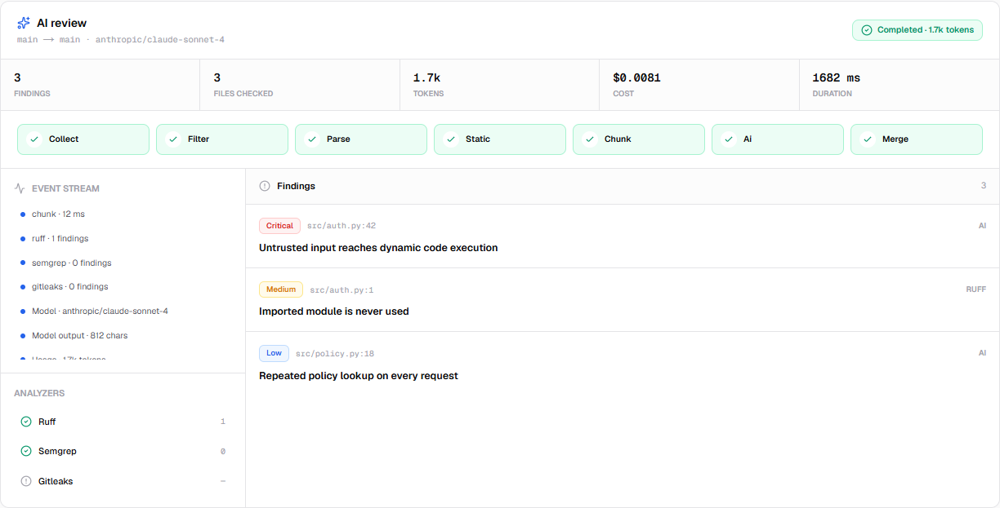
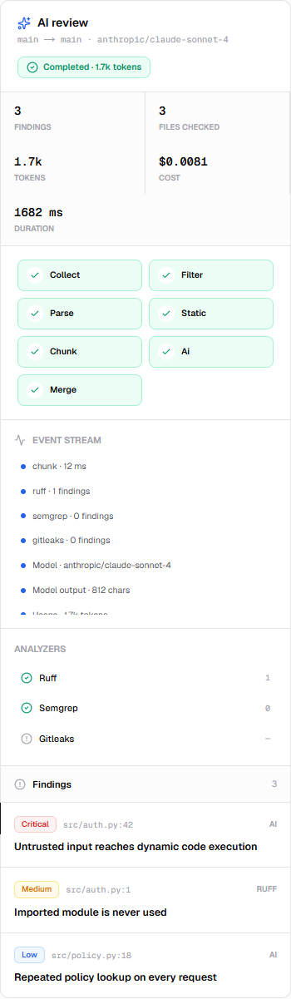

<div align="center">
  <h1>RevAI Platform</h1>
  <p><strong>Local-first AI code review with a web interface.</strong></p>
  <p>
    
    
    
    
  </p>
</div>

---

## What this is

The web evolution of RevAI. The original prompt-and-PowerShell version in
[`../revai/`](../revai/) **stays untouched and keeps working** — this is a parallel
path, not a replacement.

What changes: instead of asking an AI to do everything, a Python backend does the
deterministic work first — parse the diff, drop noise, run linters — and the model
only sees what actually needs judgement. That typically cuts token spend by more than
half and removes a lot of false positives.

**Guarantees:**

- Runs on `127.0.0.1`. No account, no telemetry, no cloud.
- The full repository stays local. Only filtered, changed-code chunks are sent
  to the AI provider you configure.
- Never writes to your repository — fixes are patches you review and apply.
- State is plain YAML you can read, diff and version.

---

## Quick start

Two terminals.

```bash
# terminal 1 — backend
cd platform/api
uv sync --all-groups
uv run revai-api            # → http://127.0.0.1:8799

# terminal 2 — frontend
cd platform/web
npm install
## Phase 5 in action

The project inspector now runs the full hybrid review and keeps its evidence in
one view: seven pipeline stages, live provider events, analyzer results, token
and cost accounting, and merged findings.



The same workflow remains usable on a narrow viewport, with stages and metrics
wrapping into stable rows.



The API stream and event examples are documented in
[`docs/PHASE-5.md`](docs/PHASE-5.md).

npm run dev                 # → http://localhost:3000
```

**Requires:** Python 3.12+ with [uv](https://docs.astral.sh/uv/), and Node 20+.

---

## Layout

```text
platform/
├── api/      FastAPI backend · uv
├── web/      Next.js frontend · npm
├── docs/     ARCHITECTURE.md · PHASE-0.md
└── mocks/    the design exploration that produced Paper Light
```

Two independent folders on purpose: a Python developer never needs Node installed to
work on the API, and vice versa.

---

## Design system — "Paper Light"

Light-mode editorial: hairline borders, generous whitespace, monospaced numbers, and
**no gradients, no blur, no coloured shadows**. Colour is reserved for state.

Chosen from seven explored directions — open [`mocks/index.html`](mocks/index.html) to
see them all, and [`mocks/08-paper-light-system.html`](mocks/08-paper-light-system.html)
for the merged system.

| Token | Value | Use |
|---|---|---|
| canvas / paper | `#fafafa` / `#ffffff` | Background and surfaces |
| ink | `#09090b` | Text and primary actions |
| line | `#e4e4e7` | Hairline borders |
| critical | `#dc2626` | Bugs, security, leaks |
| medium | `#d97706` | SOLID, performance, smells |
| low | `#2563eb` | Naming, formatting |
| success | `#059669` | Passing state |

### Radius scale

Corners follow one rule: **a child is always rounder-by-less than its parent**,
because `inner = outer − padding` is what makes nested elements look concentric
instead of fighting each other.

| Token | Size | Use |
|---|---|---|
| `rounded-xs` | 4px | Inline code, dots, tiny tags |
| `rounded-chip` | 6px | Icon boxes, swatches, code blocks |
| `rounded-control` | 8px | Buttons, inputs, inset regions |
| `rounded-card` | 10px | Cards nested inside a panel |
| `rounded-panel` | 11px | Top-level panels — the workhorse |

Components reference the **semantic** names, never raw sizes, so the whole product
re-proportions from one place. A flush header uses `.flush-top`, which re-applies the
parent radius minus the 1px border so no sliver of background shows in the corners.

---

## Roadmap

| Phase | Scope | Status |
|:--:|---|:--:|
| 0 | Skeleton — scaffold, theme, health check | ✅ |
| 1 | Storage & config — YAML repositories, atomic writes | ✅ |
| 2 | Providers — OpenRouter, detection, onboarding | ✅ |
| 3 | Projects & git — open local, clone, diff preview | ✅ |
| 4 | Deterministic pipeline — linters, AST, **zero tokens** | ✅ |
| 5 | AI stage — streaming, pipeline & event stream | ✅ |
| 6 | Results — findings, split diff, patches | next |
| 7 | Export & insights — JSON, Markdown, HTML, metrics | |
| 8 | CLI adapters — Claude Code, Copilot, Kiro | |
| 9 | Packaging — Docker, CLI entrypoint, CI | |
| 10 | More providers — Anthropic, OpenAI, Gemini, Ollama | |

Full reasoning in [`docs/ARCHITECTURE.md`](docs/ARCHITECTURE.md).
Per-phase details and verification: [`docs/PHASE-0.md`](docs/PHASE-0.md) ·
[`docs/PHASE-1.md`](docs/PHASE-1.md) · [`docs/PHASE-2.md`](docs/PHASE-2.md) ·
[`docs/PHASE-3.md`](docs/PHASE-3.md) · [`docs/PHASE-4.md`](docs/PHASE-4.md) ·
[`docs/PHASE-5.md`](docs/PHASE-5.md).

> Detection runs real subprocesses, so `pytest` excludes those by default. Run them
> explicitly with `uv run pytest -m cli` — see
> [`docs/PHASE-2.md`](docs/PHASE-2.md#test-suite-speed).

## Where your data lives

```text
~/.revai/
├── config.yaml          engine, budget, analysers, interface
├── credentials.yaml     API keys · chmod 600 · never inside a project
├── projects/<id>.yaml
├── reviews/<project>/<id>.yaml
├── rules/
└── cache/               disposable
```

Written atomically — serialise, then `os.replace` — so an interrupted save can never
leave a corrupt file. Guarded by a file lock, and every document carries a
`schema_version` for future migrations.

---

## Development

```bash
# backend
cd api && uv run pytest && uv run ruff check .

# frontend
cd web && npm run typecheck && npm run lint && npm run audit:prod
```

`npm run audit:prod` must report zero. See
[`web/SECURITY-NOTES.md`](web/SECURITY-NOTES.md) for why the full `npm audit` still
shows dev-tooling advisories and why forcing a fix would be worse.

---

<div align="center">
  <sub>Senior Labs · originally conceived by Jonathas Souza</sub>
</div>
